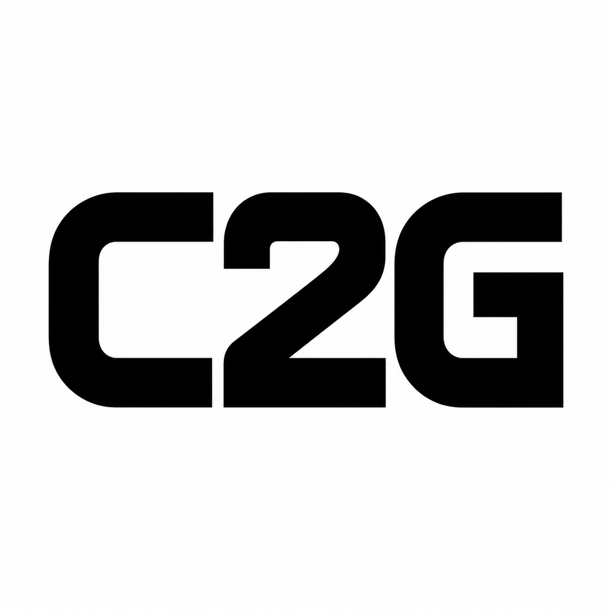

<p align="center">
  
</p>

<h1 align="center">Code2Git</h1>

<p align="center">
  <strong>Automatically sync your competitive programming and coding platform solutions directly to GitHub.</strong>
</p>

<p align="center">
  
  
  
</p>

---

**Code2Git** is a modern, lightweight, and secure browser extension designed for developers and competitive programmers. It automatically captures your accepted submissions from major coding platforms and commits them to your GitHub repository in real time. 

No more manual copy-pasting—build your coding portfolio effortlessly as you solve problems!

---

## ✨ Features

- **Multi-Platform Support:** 
  - 🟡 **LeetCode** (Problems & Submissions)
  - 🔴 **Codeforces** (Contests & Problemset)
  - 🟢 **GeeksforGeeks** (Practice Portal)
- **100% Secure & Client-Side:** Your GitHub Personal Access Tokens (PAT) and session data are stored securely using Chrome's local storage API. They never touch external middleman servers.
- **Support for OAuth & PAT:** Connect your GitHub account seamlessly via **OAuth Device Flow** or directly using a **Personal Access Token (PAT)**.
- **Custom Leaderboard & Stats:** Keep track of your coding metrics (total solved, submission timeline, platform distributions) inside a beautiful, interactive dashboard.
- **Private Coding Clubs:** Set up a custom Firebase Realtime Database URL to share rankings and build a private leaderboard with your friends or university coding club.

---

## 🛠️ Supported Platforms

| Platform | Domain | Parsing Mode | Context |
| :--- | :--- | :--- | :--- |
| **LeetCode** | `leetcode.com` | GraphQL API | Active User Session |
| **Codeforces** | `codeforces.com` | Submission Details | DOM Parsing |
| **GeeksforGeeks** | `geeksforgeeks.org` | Practice API / DOM | Inject Script |

---

## 🚀 Installation & Local Setup

If you want to run Code2Git locally in developer mode:

### 1. Clone the Repository
```bash
git clone https://github.com/krishnasahoo11156/Code2Git.git
cd Code2Git
```

### 2. Load the Extension in Chrome / Edge
1. Open your browser and navigate to the extensions management page:
   - Chrome: `chrome://extensions/`
   - Edge: `edge://extensions/`
2. Enable **Developer Mode** (usually a toggle in the top-right corner).
3. Click **Load unpacked** (top-left button).
4. Select the `Code2Git` root folder (where your `manifest.json` resides).

---

## ⚙️ Configuration

1. Click the **Code2Git** icon in your browser's toolbar.
2. Select your connection method:
   - **OAuth (Recommended):** Click **Authorize** to generate a device code, link it to your GitHub profile, and log in securely.
   - **Personal Access Token (PAT):** Create a token on GitHub with `repo` scope and enter it directly.
3. Specify your repository details:
   - **Repository Owner:** Your GitHub username.
   - **Repository Name:** The repository where solutions will be committed (e.g., `my-leetcode-solutions`). If it doesn't exist, the extension will create it for you automatically!
   - **Branch:** Defaults to `main`.
4. Click **Save Settings** and start solving problems!

---

## 🛡️ Privacy & Security First

Unlike other sync extensions, Code2Git does not run on a centralized backend.
* **No Server Intermediation:** All GitHub API operations and page scrapes are performed directly from your local browser context.
* **Credentials Safety:** Your tokens are encrypted and saved within `chrome.storage.local`.
* **Zero Logging:** We do not track, collect, or store your code submissions or personal data.

---

## 📂 Folder Structure

```text
├── icons/                 # Extension logos and asset images
├── background.js          # Background service worker (listens for success actions)
├── content.js             # Platform content parser (LeetCode)
├── content_cf.js          # Platform content parser (Codeforces)
├── content_gfg.js         # Platform content parser (GeeksforGeeks)
├── content_gfg_main.js    # GeeksforGeeks DOM execution script
├── dashboard.html         # Custom options & stats dashboard UI
├── dashboard.js           # Analytics dashboard controller
├── manifest.json          # Chrome Extension Manifest V3 configuration
├── popup.html             # Options/Setup card popup UI
└── popup.js               # Popup interactions and authentication flow
```

---

## 📄 License

This project is licensed under the MIT License - see the [LICENSE](LICENSE) file for details.
